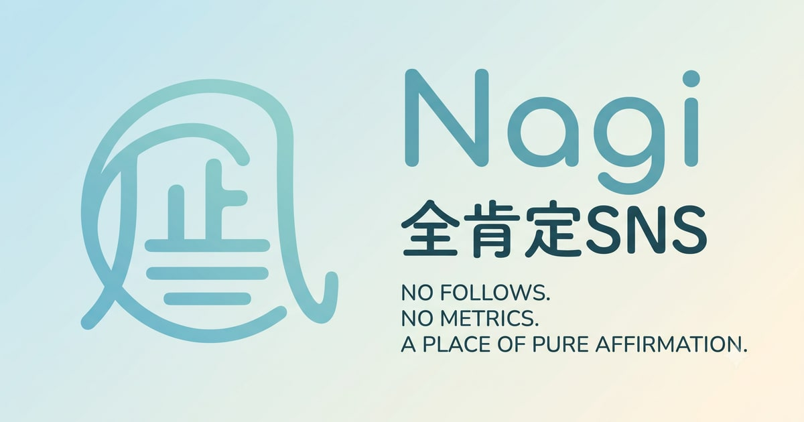

<div align="center">
  

# Nagi

全肯定botたんが言葉を受け止める、AT Protocol上の全肯定SNS

[Nagiを開く](https://nagi.suibari.com/) · [Nagiについて](https://nagi.suibari.com/about) · [利用規約](https://nagi.suibari.com/terms) · [プライバシーポリシー](https://nagi.suibari.com/privacy)
</div>



Nagi（ナギ）は、いいねやフォローの数を気にせず、自由に気持ちを投稿できるSNSです。投稿には全肯定botたんが必ず返信します。アカウントと投稿データには[AT Protocol](https://atproto.com/)を採用しています。

## 主な機能

- 全肯定botたんからの返信
- 最大3,000文字のMarkdown投稿と投稿後の編集
- 公開範囲を選べる「こっそり投稿」
- 興味の近い人が集まるチャンネル
- 絵文字リアクションとカスタム絵文字
- 投稿の自動翻訳、日記、自動下書き保存
- Blueskyへのクロスポストと、対応アプリ向けのブログ公開
- Blueskyとは独立したNagiプロフィール
- Web Push通知とPWA対応
- 日本語・英語表示、複数のカラーテーマ

公開投稿は原則としてユーザー自身のPDSに保存されます（こっそり投稿を除く）。機能やAT Protocolを採用する理由は「[Nagiについて](https://nagi.suibari.com/about)」をご覧ください。

## 技術スタック

| 分類             | 採用技術                         |
| ---------------- | -------------------------------- |
| UI               | Svelte 5, SvelteKit, TypeScript  |
| ビルド・スタイル | Vite, Tailwind CSS               |
| プロトコル・認証 | AT Protocol, OAuth               |
| テスト・整形     | Vitest, svelte-check, Prettier   |
| ホスティング     | Vercel（静的アプリ + Functions） |

このリポジトリはWebクライアントです。タイムラインの集約やbotたんの返信など、AppView側の処理は含みません。

## ローカル開発

### 必要なもの

- Node.js 22以上
- npm 10以上
- Nagi AppView（データ取得を伴う機能を確認する場合）

### セットアップ

```sh
git clone https://github.com/suibari/nagi_client.git
cd nagi_client
npm install
cp .env.example .env.local
npm run dev
```

ターミナルに表示されたURLをブラウザで開きます。ブラウザも同時に開く場合は次を実行します。

```sh
npm run dev -- --open
```

AppViewを起動せずに投稿の基本表示や翻訳・本文省略、インタラクション演出を確認する場合は、
開発サーバーの `/dev/interactions` を開きます。このページのモックデータはブラウザ内だけで
描画され、API・PDS・AppViewへは送信されません。

依存関係をlockfileどおりに再現したい場合は、`npm install` の代わりに `npm ci` を使ってください。

### 環境変数

`.env.example` を `.env.local` にコピーして使用します。`PUBLIC_APPVIEW_URL` と `PUBLIC_VAPID_KEY` はSvelteKitの静的環境変数として読み込むため、値が空でもキー自体が必要です。

```dotenv
PUBLIC_APPVIEW_URL=http://localhost:3002
PUBLIC_APPVIEW_DIRECT=true
PUBLIC_VAPID_KEY=
```

| 変数                    | 用途                                                          | 既定値                  |
| ----------------------- | ------------------------------------------------------------- | ----------------------- |
| `PUBLIC_APPVIEW_URL`    | Nagi AppViewのベースURL                                       | `http://localhost:3002` |
| `PUBLIC_APPVIEW_DIRECT` | 開発時、ログイン中の通信もVite経由でローカルAppViewへ直接送る | `false`                 |
| `PUBLIC_VAPID_KEY`      | Web Push購読に使う公開VAPID鍵。空の場合はPush通知を無効化する | 空                      |

`PUBLIC_APPVIEW_DIRECT=true` を使う場合、AppView側でも開発用のviewer引き渡しを許可する設定が必要です。このモードはローカル開発専用です。

## コマンド

| コマンド               | 内容                                               |
| ---------------------- | -------------------------------------------------- |
| `npm run dev`          | 開発サーバーを起動                                 |
| `npm run build`        | 本番用ビルドを生成                                 |
| `npm run preview`      | 生成した本番ビルドを確認                           |
| `npm test`             | Vitestのテストを1回実行                            |
| `npm run test:watch`   | Vitestをwatchモードで実行                          |
| `npm run check`        | APIの型チェック、SvelteKit同期、Svelteの診断を実行 |
| `npm run format`       | Prettierでファイルを整形                           |
| `npm run format:check` | 整形差分がないか確認                               |

変更を提出する前の基本チェックは次のとおりです。

```sh
npm test
npm run check
npm run format:check
npm run build
```

## ディレクトリ構成

```text
.
├── api/                  # Vercel Functions（OGP画像、SPAレスポンス）
├── src/
│   ├── lib/              # API、AT Protocol、状態管理、共通コンポーネント
│   ├── routes/           # SvelteKitのページとエンドポイント
│   └── service-worker.ts # Web Push受信
├── static/               # アイコン、画像、manifestなどの静的ファイル
├── vite.config.ts        # SvelteKit、CSP、開発用proxyの設定
└── vercel.json           # Header、redirect、rewriteの設定
```

Svelteコンポーネントではrunesモードを使用しています。ユニットテストは `src/**/*.test.ts` と `api/**/*.test.ts` が対象です。

## Vercelへのデプロイ

`develop` ブランチのPreviewでは、Vercelが生成する固定ブランチURLをOAuthの `client_id` とcallbackに自動利用します。現在の固定URLは `https://nagi-client-git-develop-suibaris-projects.vercel.app` です。一般には `<project>-git-develop-<scope>.vercel.app` という形式で、VercelのDeployment画面、GitHubのPreviewリンク、またはビルドログの `VERCEL_BRANCH_URL` でも確認できます。

VercelのProject Settingsでは次を設定してください。

- Environment Variablesで **Automatically expose System Environment Variables** を有効化する。Previewビルドには `VERCEL_ENV` と `VERCEL_BRANCH_URL` が必要です。
- Preview環境の `PUBLIC_APPVIEW_URL` を `https://nagi-api.suibari.com` にする。
- Project Settings > Deployment Protection > Vercel AuthenticationでPreviewの保護を無効化する。OAuthの認可サーバーはVercelへログインできないため、固定ブランチURLの `/client-metadata.json` が未認証で `200 application/json` を返す必要があります。Vercel既定のPreview URLには、公開後も `X-Robots-Tag: noindex` が自動付与されます。

コミット固有URLから開いた場合は、OAuth stateとcallbackのoriginを一致させるため、同じパスの固定ブランチURLへ自動的に移動します。本番ビルドでは `https://nagi.suibari.com` を使用します。

## UI変更時の確認

スマートフォンで長いURLや空白のない文字列がカードを押し広げないよう、次のルールを守ります。

- `flex` / `grid` 内の可変幅の子要素と、その内側にある可変幅コンテナには `min-inline-size: 0` を指定する。
- 可変幅のgrid列には `1fr` ではなく `minmax(0, 1fr)` を使う。
- 本文やタイトルなど、内容を読める必要がある文字列には `overflow-wrap: anywhere` を使う。
- URL、ホスト名、ハンドルなど、一行で表示するメタ情報には `overflow: hidden`、`text-overflow: ellipsis`、`white-space: nowrap` を組み合わせる。
- `body` の `overflow-x` は画面全体の横スクロールを抑える最後の安全策であり、子要素のはみ出しを隠すための修正には使わない。
- 変更時は320px、375px、600pxの表示幅で長いURLと空白のない文字列を入れ、カードとページの `scrollWidth` が `clientWidth` を超えないことを確認する。

## コントリビューション

不具合報告や提案は[GitHub Issues](https://github.com/suibari/nagi_client/issues)へお願いします。変更を提案する場合は、関連するIssueを作成または確認してからPull Requestを送ってください。

## ライセンス

本ソフトウェアは[MIT License](./LICENSE)の下で公開されています。
